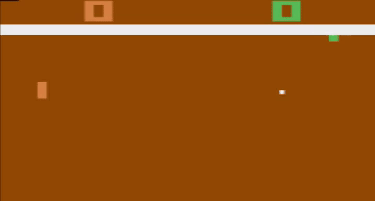
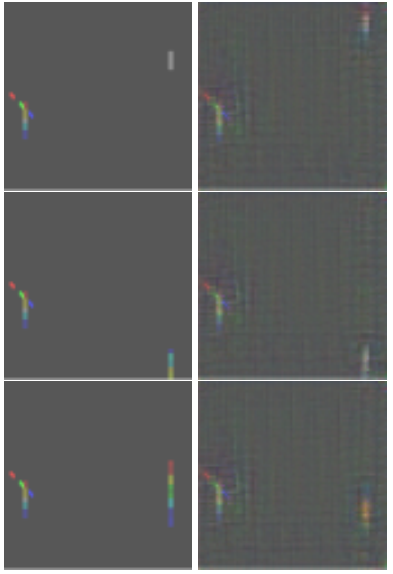

# Dreaming of Reinforcement Learning: GAN-enhanced Experience-Replay
## Bachelor’s Project Thesis
The last decade has seen an extraordinary rise in popularity of Deep Reinforcement
Learning (DRL) techniques, due to their capacity of attaining super-human results in most types
of control tasks. However, they all suffer from the substantial drawback of long training times.
Past studies have tried to minimize training time by improving the trajectories of the ExperienceReplay (ER) memory buffer. This thesis explores the possibility of improving the convergence
time of the Deep Q-Learning algorithm by initializing its ER memory buffer with GAN-generated
trajectories. The Deep Q-Network (DQN) agents are tested on the Atari 2600 game of Pong, in
which the states to be generated are represented by frames of the game. Results show that the
DQN agent corresponding to the initialized memory buffer does not exhibit a significantly faster
convergence time to the same reward as the non-initialized agent.

*Atari 2600 Pong*

*Hand-picked images from the original dataset (left column) and randomly-picked
generated images (right column). Each overlapping frame is colored as to showcase the movement of the ball and paddles. The images used
in the algorithm are completely gray-scale.*